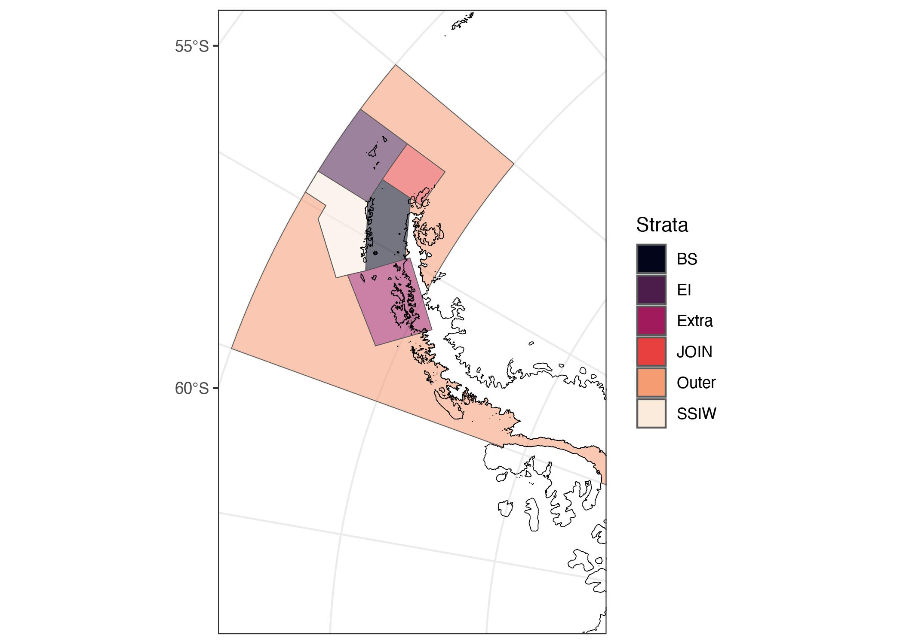
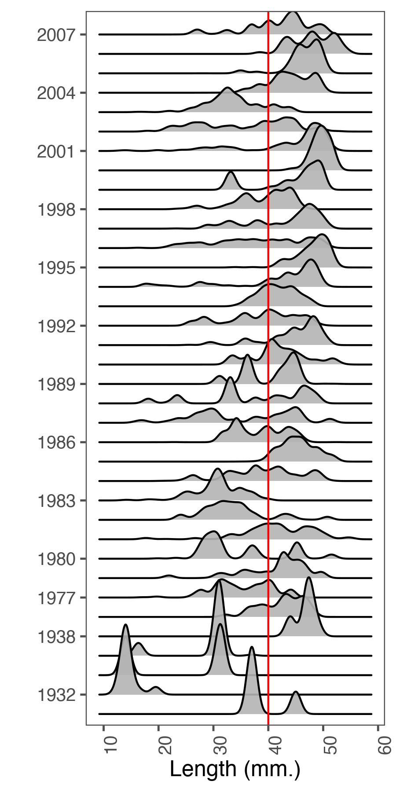
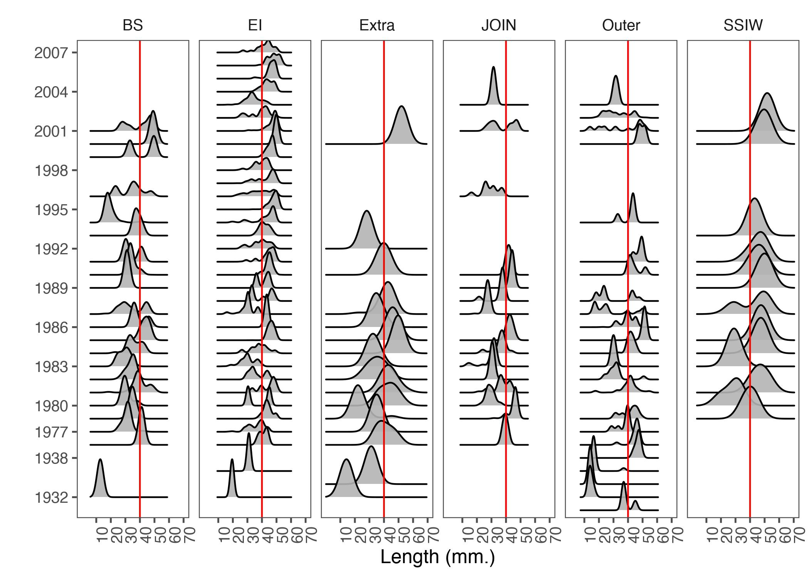

```r
rm(list = ls())
knitr::opts_chunk$set(echo = TRUE,
                      message = FALSE,
                      warning = FALSE,
                      fig.align = 'center',
                      dev = 'jpeg',
                      dpi = 300)
#XQuartz is a mess, put this in your onload to default to cairo instead
options(bitmapType = "cairo") 
# (https://github.com/tidyverse/ggplot2/issues/2655)
# Lo mapas se hacen mas rapido
```


```r
library(tidyverse)
library(ggridges)
library(readr)
library(sp)
library(sf)
library(CCAMLRGIS)
library(ggthemes)
```

# Background

The following document intends to carry out a complementary
methodological analysis to explore, in this case, with a
biological component like lengths from Lengh Frecuency [KRILLDATA Base](https://apex.nerc-bas.ac.uk/f?p=198:1:0).


# Methodology

Load data 


```r
Net_haul_details <- read.csv("Net haul details.csv",sep=",")
names(Net_haul_details)
```

```
##  [1] "Id"                                                
##  [2] "Ref..haul.identifier."                             
##  [3] "Cruise"                                            
##  [4] "Station"                                           
##  [5] "Event"                                             
##  [6] "Netno"                                             
##  [7] "Nettype"                                           
##  [8] "Net.mouthm2"                                       
##  [9] "Net.mesh.mm."                                      
## [10] "Trajectorycode"                                    
## [11] "Date"                                              
## [12] "Year"                                              
## [13] "Month"                                             
## [14] "Day"                                               
## [15] "GMT.time"                                          
## [16] "Local.time"                                        
## [17] "Day.night"                                         
## [18] "Latitude..dec.degrees."                            
## [19] "Longitude..dec.degrees."                           
## [20] "Minimumnet.depth.m."                               
## [21] "Maximum.net.depth..m."                             
## [22] "Water.depth.mean.within.10km.range..m."            
## [23] "Water.depth.range.within.10km.range..m."           
## [24] "Mean.climatological.temperature.within.10.km.range"
## [25] "Bin.size"                                          
## [26] "Mean.length..mm."                                  
## [27] "Total.krill.in.sample"                             
## [28] "Source"                                            
## [29] "Comments"
```

```r
dim(Net_haul_details)
```

```
## [1] 6470   29
```

```r
table(Net_haul_details$Year)
```

```
## 
## 1926 1927 1928 1929 1930 1931 1932 1933 1934 1935 1936 1937 1938 1939 1950 1951 
##    2    2    9    8    8   26   74    8   93  106  155  135  272  113   18   38 
## 1976 1977 1978 1979 1980 1981 1982 1983 1984 1985 1986 1987 1988 1989 1990 1991 
##   97   39  108   19  144  283  408  236  428  362  174  107  155   29  214  110 
## 1992 1993 1994 1995 1996 1997 1998 1999 2000 2001 2002 2003 2004 2005 2006 2007 
##  111  136  191  114  373   87  140   58  227  328  164  154  101   89   51   46 
## 2008 2009 2010 2011 2012 2013 2015 
##   47   18    6   10   20   10    9
```

Fist thing is select main columns, like 


```r
Net_fill <- Net_haul_details %>% 
  select(c(-2,-15, -28, -29))
```


We define spatial scale, in this case, Strata from 48.1


```r
# Cargo linea de costa
coast <- load_Coastline()
coast1<- st_as_sf(coast) 
coast2 = st_transform(coast1, "+proj=latlong +ellps=WGS84")
# Uso las agrupaciones de Strata
strata <- st_read("~/DOCAS/Mapas/Antarctic_SHPfiles/Strata.shp",
                quiet=T)
strata=st_transform(strata, "+proj=latlong +ellps=WGS84")
```


transfrom data to `sf` object.


```r
Net_fill2 <- st_as_sf(Net_fill %>% 
                     drop_na(Latitude..dec.degrees.), 
                   coords = c("Longitude..dec.degrees.", "Latitude..dec.degrees."),  
                  crs = "+proj=latlong +ellps=WGS84")
```

Show strata agregation to join length data (Figure\@ref(fig:maptest).


```r
# y testeo el mapa
ssmap <- ggplot()+
  geom_sf(data = strata, aes(fill=strata$ID, 
                           alpha=0.3))+
  # geom_sf(data = ssmu481aa, aes(fill=ssmu481aa$GAR_Short_Label, 
  #                         alpha=0.3))+
  geom_sf(data = coast2, colour="black", fill=NA)+
  #geom_sf(data = gridcrop1, colour="black", fill=NA)+
  #geom_sf(data= suba1aa, fill=NA)+
  # geom_sf(aes(fill=ssmu481aa$GAR_Short_Label,
  #              alpha=0.3))+
  scale_fill_viridis_d(option = "F",
                       name="Strata")+
  #geom_sf_label(aes(label = strata$ID))+
  # labs(fill = "SSMU")+
  ylim(230000, 2220000)+
  xlim(-3095349 , -1858911)+
  # coord_sf(crs = 32610)+ #sistema de prpyecccion para campos completos
  coord_sf(crs = 6932)+
  scale_alpha(guide="none")+
  theme_bw()
ssmap
```

<div class="figure" style="text-align: center">

<p class="caption">Strata Maps in 48.1</p>
</div>


```r
# comoprobar si tengo datos duplicados
strata2 <- st_make_valid(strata)
dat_len_strata <- st_join(strata2, Net_fill2)
```


Expand frecuency data related length, in this case `amount` column have frecuency that we need expand to whole data frame. 


```r
dat_len_strata2 <- as.data.frame(dat_len_strata)
```


```r
df <- dat_len_strata2 %>% 
  type.convert(as.is = TRUE) %>% 
  uncount(Total.krill.in.sample)
```
by year


```r
jzs <- ggplot(df ,
                   aes(x=Mean.length..mm., 
                       y = as.factor(Year)))+
  geom_density_ridges(stat = "density_ridges", bins = 30, 
                      scale = 3.9, 
                      draw_baseline = FALSE,
                      alpha=0.9)+
  geom_vline(xintercept = 40, color = "red")+
  scale_x_continuous(breaks = seq(from = 10, to = 80, 
                                  by = 10))+
  scale_y_discrete(breaks = seq(from = 1926, 
                                to = 2007, by = 3))+
  scale_fill_viridis_d(name="Strata",
                       option="H")+
  
  theme_few()+
  theme(axis.text.x = element_text(angle = 90, hjust = 2))+
  xlab("Length (mm.)")+
  ylab("")
jzs
```




by strata


```r
jzstrata <- ggplot(df ,
                   aes(x=Mean.length..mm., 
                       y = as.factor(Year),
                       (fill=Cruise)))+
  geom_density_ridges(stat = "density_ridges",
                      bins = 30, 
                      scale = 2.9, 
                      draw_baseline = FALSE,
                      alpha=0.9)+
  scale_fill_viridis_c()+
  facet_grid(.~ID) +   
  geom_vline(xintercept = 40, color = "red")+
  scale_x_continuous(breaks = seq(from = 10, to = 80, 
                                  by = 10))+
  scale_y_discrete(breaks = seq(from = 1926, 
                                to = 2007, by = 3))+
  scale_fill_viridis_d(name="Strata",
                       option="H")+
  
  theme_few()+
  theme(axis.text.x = element_text(angle = 90, hjust = 2))+
  xlab("Length (mm.)")+
  ylab("")
jzstrata
```



by net type


```r
jzsnet <- ggplot(df ,
                   aes(x=Mean.length..mm., 
                       y = as.factor(Year),
                       (fill=Cruise)))+
  geom_density_ridges(stat = "density_ridges",
                      bins = 30, 
                      scale = 1.9, 
                      draw_baseline = FALSE,
                      alpha=0.9)+
  scale_fill_viridis_c()+
  facet_grid(~Nettype) +   
  geom_vline(xintercept = 40, color = "red")+
  scale_x_continuous(breaks = seq(from = 10, to = 80, 
                                  by = 10))+
  scale_y_discrete(breaks = seq(from = 1926, 
                                to = 2007, by = 3))+
  scale_fill_viridis_d(name="Strata",
                       option="H")+
  
  theme_few()+
  theme(axis.text.x = element_text(angle = 90, hjust = 2))+
  xlab("Length (mm.)")+
  ylab("")
jzsnet
```


```r
# cut in order
df$catlon <- cut(x = df$length, 
                 breaks = seq(0,70,2),
                 labels = seq(0,68,2),
                 right = FALSE)

dft <- table(df$Year, df$catlon)
```


```r
write.csv(dft, "lenghtkrillbase19262007.csv", sep = ",", row.names = TRUE)
```

