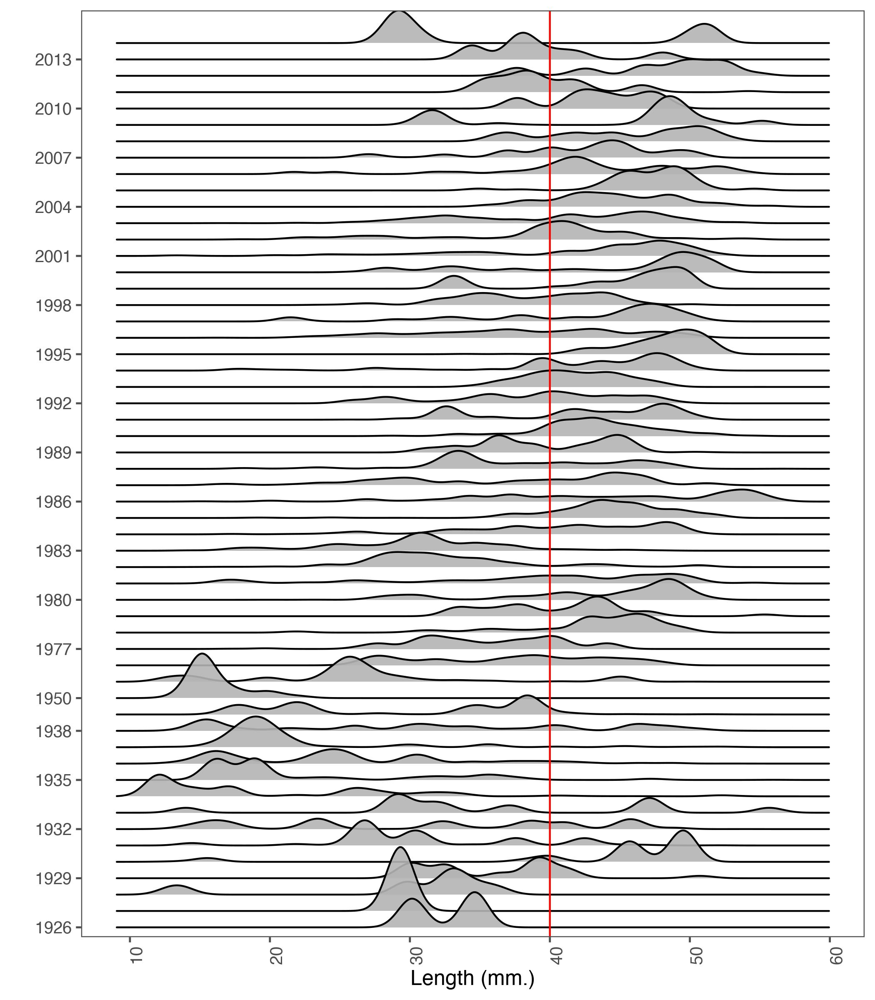
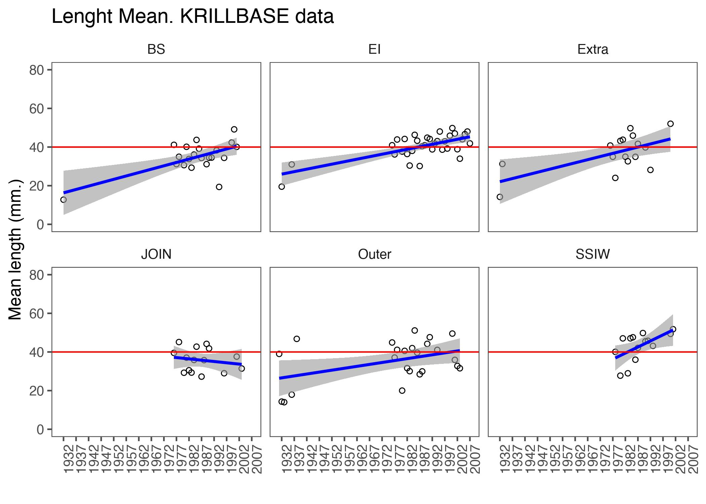

## Background

The following code perform as an  Exploratory Data Analysis of Krill *Euphausia superba* based in Area 481, and with special emphasis on the proposed new management strata. The idea is to observe and prepare the days to incorporate into the stock assessment. This data base was download from [KRILLDATA Base](https://apex.nerc-bas.ac.uk/f?p=198:1:0).

## Set up and libraries


```r
rm(list = ls())
knitr::opts_chunk$set(echo = TRUE,
                      message = FALSE,
                      warning = FALSE,
                      fig.align = 'center',
                      dev = 'jpeg',
                      dpi = 300)
#XQuartz is a mess, put this in your onload to default to cairo instead
options(bitmapType = "cairo") 
# (https://github.com/tidyverse/ggplot2/issues/2655)
# Lo mapas se hacen mas rapido
```


```r
library(tidyverse)
library(ggridges)
library(readr)
library(sp)
library(sf)
library(CCAMLRGIS)
library(ggthemes)
```

## Load data and a glimpse about structure


```r
Net_haul_details <- read.csv("Net haul details.csv",sep=",")
names(Net_haul_details)
```

```
##  [1] "Id"                                                
##  [2] "Ref..haul.identifier."                             
##  [3] "Cruise"                                            
##  [4] "Station"                                           
##  [5] "Event"                                             
##  [6] "Netno"                                             
##  [7] "Nettype"                                           
##  [8] "Net.mouthm2"                                       
##  [9] "Net.mesh.mm."                                      
## [10] "Trajectorycode"                                    
## [11] "Date"                                              
## [12] "Year"                                              
## [13] "Month"                                             
## [14] "Day"                                               
## [15] "GMT.time"                                          
## [16] "Local.time"                                        
## [17] "Day.night"                                         
## [18] "Latitude..dec.degrees."                            
## [19] "Longitude..dec.degrees."                           
## [20] "Minimumnet.depth.m."                               
## [21] "Maximum.net.depth..m."                             
## [22] "Water.depth.mean.within.10km.range..m."            
## [23] "Water.depth.range.within.10km.range..m."           
## [24] "Mean.climatological.temperature.within.10.km.range"
## [25] "Bin.size"                                          
## [26] "Mean.length..mm."                                  
## [27] "Total.krill.in.sample"                             
## [28] "Source"                                            
## [29] "Comments"
```

```r
dim(Net_haul_details)
```

```
## [1] 6470   29
```

```r
table(Net_haul_details$Source)
```

```
## 
##                                                                                                                                                                     1991 austral summer Japanese data sent by Taro Ichii (spermatophore notes not entered) 
##                                                                                                                                                                                                                                                         59 
##                                                                                                                                                                                                                      1996 Ori net data sent by Sanae Chiba 
##                                                                                                                                                                                                                                                          8 
##                                                                                                                                                                                                         Ashjian et al (2004) Deep Sea Res II 51, 2073-2098 
##                                                                                                                                                                                                                                                         12 
##                                                                                                                                                                            Australian Antarctic Division data for BROKE Survey (1996) sent by So Kawaguchi 
##                                                                                                                                                                                                                                                        100 
##                                                                                                                                                                           Australian Antarctic Division data for KACTAS Survey (2001) sent by So Kawaguchi 
##                                                                                                                                                                                                                                                         90 
##                                                                                                                                                                             Australian Antarctic Division data for KAOS Survey (2003) sent by So Kawaguchi 
##                                                                                                                                                                                                                                                         46 
##                                                                                                                                                                            British Antarctic Survey, data available from UK PDC JR15002 RMT8 data archive. 
##                                                                                                                                                                                                                                                          9 
##                                                                                                                                                                           British Antarctic Survey, data available from UK PDC Low Trophic Level database. 
##                                                                                                                                                                                                                                                        346 
##                                                                                                                                                         British Antarctic Survey, data available from UK PDC Offshore Biological Programme (OBP) database. 
##                                                                                                                                                                                                                                                        567 
##                                               Data from the "Biological Investigations of Marine Antarctic Systems and Stocks" (BIOMASS) programme of the 1980s, stored at British Antractic Survey, and transcribed to KRILLBASE by Mark Jessopp in 2007. 
##                                                                                                                                                                                                                                                        433 
## Data from the "Discovery" Era (1920s and 1930s) digitised as part of the "Biological Investigations of Marine Antarctic Systems and Stocks" (BIOMASS) programme of the 1980s, and stored at British Antractic Survey. Transcribed by Mark Jessopp in 2007. 
##                                                                                                                                                                                                                                                       1067 
##                                                                                                                                                                                         Data sent by Kendra Daly on the US SO GLOBEC Program (winter data) 
##                                                                                                                                                                                                                                                        120 
##                                                                                                                                                                                      Endo et al (1986) Mem. Natl. Inst. Polar Res. Spec. Issue 44, 107-117 
##                                                                                                                                                                                                                                                          5 
##                                                                                                                                                                                             Fevolden & George (1984) J. Crust Biol. 4 (Spec. No 1) 107-122 
##                                                                                                                                                                                                                                                         15 
##                                                                                                                                                                                        German data sent by Volker Siegel, Sea Fisheries Institute, Hamburg 
##                                                                                                                                                                                                                                                       1518 
##                                                                                                                                                                                                                Higginbottom & Hosie (1989) MEPS 58 197-203 
##                                                                                                                                                                                                                                                          2 
##                                                                                                                                                                                                                 Hosie et al (1987) ANARE Research Notes 57 
##                                                                                                                                                                                                                                                          1 
##                                                                                                                                                                                                                 Hosie et al (1991) ANARE Research Notes 79 
##                                                                                                                                                                                                                                                         29 
##                                                         Jazdzewski, K et al (1978) Biological and populational studies on krill near South Shetland Islands, Scotia Sea and South Georgia in the summer 1976. Polskie Archiwum Hydrobiologii 25(3) 607-631 
##                                                                                                                                                                                                                                                         97 
##                                                                                                                                                                                                           Kasatkina, S.M. (1997) CCAMLR Science 4, 161-169 
##                                                                                                                                                                                                                                                          6 
##                                                                                                                                                                                                   Kaufmann, R.S. et al (2003) Deep Sea Res II 50 1765-1785 
##                                                                                                                                                                                                                                                          5 
##                                                                                                                                                                                                         Lancraft et al (2004) Deep Sea Res II 51 2247-2260 
##                                                                                                                                                                                                                                                          1 
##                                                                                                                                                      Maklygin (1993) In. Klekowski, RZ & Opalinski, KW (Eds) 2nd Polish-Soviet Antarctic Symposium 151-157 
##                                                                                                                                                                                                                                                          8 
##                                                                                                                                                                                                                         Nordhausen (1994) MEPS 109 131-142 
##                                                                                                                                                                                                                                                          1 
##                                                                                                                                                                                          Old US expedition data (e.g. AMERIEZ, Protea) sent by Kendra Daly 
##                                                                                                                                                                                                                                                         89 
##                                                                                                                                     Pakhomov et al (unpub data) Macroplankton data in the Prydz bay region in 1987-1990 from bongo & Melnikov nets catches 
##                                                                                                                                                                                                                                                         43 
##                                                                                                                                                                                                        Peruvian summer 1999/2000 data from Javier Quinones 
##                                                                                                                                                                                                                                                         13 
##                                                                                                                                                                                                                   Sala et al (2002) Sci Mar. 66(2) 123-133 
##                                                                                                                                                                                                                                                          1 
##                                                                                                                                                                                                      Stepnik, R. (1982) Polish Polar Research 3(1-2) 49-68 
##                                                                                                                                                                                                                                                         16 
##                                                                                                                                                                                   Terazaki & Wada (1986) Mem. Natl Inst. Polar Res. Spec. Issue 40, 97-109 
##                                                                                                                                                                                                                                                          7 
##                                                    Ukrainian data (digital photos of net logsheets) sent in 2 batches by Boris Trotsenko, translated by Evgeny Pakhomov, transcribed by Mark Jessopp, Catherine Brester, Angus Atkinson then Natalie Ensor 
##                                                                                                                                                                                                                                                        219 
##                                                                                                                                                          US Antarctic Marine Living Resources (AMLR) Program data sent by Roger Hewitt for the 2000 season 
##                                                                                                                                                                                                                                                         75 
##                                                                                                                                   US Antarctic Marine Living Resources (AMLR) Program data sent by Valerie Loeb (1990-2007 exclusive, missing 2000 season) 
##                                                                                                                                                                                                                                                       1418 
##                                                                                                                                                                                        Wang et al (2000) Chinese J of Oceanology & Limnology 18(2) 110-116 
##                                                                                                                                                                                                                                                          6 
##                                                                                                                                                                         Williams, R. et al (1986) ADBEX I cruise zooplankton data. ANARE Research Notes 31 
##                                                                                                                                                                                                                                                         31 
##                                                                                                                          Witek (1979) Phytoplankton distribution and some aspects of the biology of Antarctic krill (Euphausia superba). ICES CM 1979/L:14 
##                                                                                                                                                                                                                                                          7
```

Fist thing is select main columns, like 


```r
Net_fill <- Net_haul_details %>% 
  select(c(-2,-15, -29))
```

Ungrouping data to get raw count in all dataframe


```r
net_glo <- Net_fill %>% 
  type.convert(as.is = TRUE) %>% 
  uncount(Total.krill.in.sample)
```


## Plot sizes composition in global data (all Southern Ocean)


```r
jzglo <- ggplot(net_glo ,
                   aes(x=Mean.length..mm., 
                       y = as.factor(Year)))+
  geom_density_ridges(stat = "density_ridges", bins = 30, 
                      scale = 3.9, 
                      draw_baseline = FALSE,
                      alpha=0.9)+
  geom_vline(xintercept = 40, color = "red")+
  scale_x_continuous(breaks = seq(from = 10, to = 80, 
                                  by = 10))+
  scale_y_discrete(breaks = seq(from = 1926, 
                                to = 2017, by = 3))+
  theme_few()+
  theme(axis.text.x = element_text(angle = 90, hjust = 2))+
  xlab("Length (mm.)")+
  ylab("")
jzglo
```


## Group and join krill base data in Stratas
We define spatial scale, in this case, Strata from 48.1


```r
# Cargo linea de costa
coast <- load_Coastline()
coast1<- st_as_sf(coast) 
coast2 = st_transform(coast1, "+proj=latlong +ellps=WGS84")
# Uso las agrupaciones de Strata
strata <- st_read("~/DOCAS/Mapas/Antarctic_SHPfiles/Strata.shp",
                quiet=T)
strata=st_transform(strata, "+proj=latlong +ellps=WGS84")
```


transform data to `sf` object.


```r
Net_fill2 <- st_as_sf(Net_fill %>% 
                     drop_na(Latitude..dec.degrees.), 
                   coords = c("Longitude..dec.degrees.", "Latitude..dec.degrees."),  
                  crs = "+proj=latlong +ellps=WGS84")
```

Show strata agregation to join length data.


```r
# y testeo el mapa
ssmap <- ggplot()+
  geom_sf(data = strata, aes(fill=strata$ID, 
                           alpha=0.3))+
  # geom_sf(data = ssmu481aa, aes(fill=ssmu481aa$GAR_Short_Label, 
  #                         alpha=0.3))+
  geom_sf(data = coast2, colour="black", fill=NA)+
  #geom_sf(data = gridcrop1, colour="black", fill=NA)+
  #geom_sf(data= suba1aa, fill=NA)+
  # geom_sf(aes(fill=ssmu481aa$GAR_Short_Label,
  #              alpha=0.3))+
  scale_fill_viridis_d(option = "F",
                       name="Strata")+
  #geom_sf_label(aes(label = strata$ID))+
  # labs(fill = "SSMU")+
  ylim(230000, 2220000)+
  xlim(-3095349 , -1858911)+
  # coord_sf(crs = 32610)+ #sistema de prpyecccion para campos completos
  coord_sf(crs = 6932)+
  scale_alpha(guide="none")+
  theme_bw()
ssmap
```

<div class="figure" style="text-align: center">

<p class="caption">Strata Maps in 48.1</p>
</div>
## Join


```r
# comoprobar si tengo datos duplicados
strata2 <- st_make_valid(strata)
dat_len_strata <- st_join(strata2, Net_fill2)
```


Expand frecuency data related length, in this case `amount` column have frecuency that we need expand to whole data frame. 


```r
dat_len_strata2 <- as.data.frame(dat_len_strata)
```

## uncount frecuency in this data based on strata


```r
df <- dat_len_strata2 %>% 
  type.convert(as.is = TRUE) %>% 
  uncount(Total.krill.in.sample)
```


## Plot total by year in 48.1


```r
jzs <- ggplot(df ,
                   aes(x=Mean.length..mm., 
                       y = as.factor(Year)))+
  geom_density_ridges(stat = "density_ridges", bins = 30, 
                      scale = 3.9, 
                      draw_baseline = FALSE,
                      alpha=0.9)+
  geom_vline(xintercept = 40, color = "red")+
  scale_x_continuous(breaks = seq(from = 10, to = 80, 
                                  by = 10))+
  scale_y_discrete(breaks = seq(from = 1926, 
                                to = 2007, by = 3))+
  scale_fill_viridis_d(name="Strata",
                       option="H")+
  
  theme_few()+
  theme(axis.text.x = element_text(angle = 90, hjust = 2))+
  xlab("Length (mm.)")+
  ylab("")
jzs
```


## Plot by year and Strata


```r
jzstrata <- ggplot(df ,
                   aes(x=Mean.length..mm., 
                       y = as.factor(Year),
                       (fill=Cruise)))+
  geom_density_ridges(stat = "density_ridges",
                      bins = 30, 
                      scale = 2.9, 
                      draw_baseline = FALSE,
                      alpha=0.9)+
  scale_fill_viridis_c()+
  facet_grid(.~ID) +   
  geom_vline(xintercept = 40, color = "red")+
  scale_x_continuous(breaks = seq(from = 10, to = 80, 
                                  by = 10))+
  scale_y_discrete(breaks = seq(from = 1926, 
                                to = 2007, by = 3))+
  scale_fill_viridis_d(name="Strata",
                       option="H")+
  
  theme_few()+
  theme(axis.text.x = element_text(angle = 90, hjust = 2))+
  xlab("Length (mm.)")+
  ylab("")
jzstrata
```


## Calculate trends in mean lenght by Strata and year

```r
dfgru <- df %>% 
  group_by(Year, ID) %>% 
  summarize(MEANL =mean(Mean.length..mm.))
```

## Means trends in krill base by year and strata

```r
lmlenght <- ggplot(dfgru,
                   aes(Year, MEANL))+
                   #colour=CLASS))+
    geom_point(show.legend = F,
               shape=21) +
    geom_smooth(method= "lm",
                color="blue",
               alpha=0.6)+
    #scale_size(range = c(-4,8)) +
     theme_few()+ 
    facet_wrap(.~ID)+
    geom_hline(yintercept = 40, color = "red")+
    scale_x_continuous(breaks = seq(from = 1927, to = 2021, by = 5))+
    theme(axis.text.x = element_text(angle = 90, hjust = 2))+
    guides(fill = guide_legend(reverse=F))+
    scale_fill_viridis_d(option="G")+
    ylim(0,80)+
    ylab("Mean length (mm.)") +
    xlab("") +
    ggtitle("Lenght Mean. KRILLBASE data")
lmlenght
```



## krill data lenght by Source and year. (i need  improve this visualization||)


```r
jzsnet <- ggplot(df ,
                   aes(x=Mean.length..mm., 
                       y = as.factor(Year)))+
  geom_density_ridges(stat = "density_ridges",
                      bins = 30, 
                      scale = 1.9, 
                      draw_baseline = FALSE,
                      alpha=0.9)+
  scale_fill_viridis_c()+
  facet_grid(~Source) +   
  geom_vline(xintercept = 40, color = "red")+
  scale_x_continuous(breaks = seq(from = 10, to = 80, 
                                  by = 10))+
  scale_y_discrete(breaks = seq(from = 1926, 
                                to = 2007, by = 3))+
  scale_fill_viridis_d(name="Strata",
                       option="H")+
  
  theme_few()+
  theme(axis.text.x = element_text(angle = 90, hjust = 2))+
  xlab("Length (mm.)")+
  ylab("")
jzsnet
```


```r
# cut in order
df$catlon <- cut(x = df$length, 
                 breaks = seq(0,70,2),
                 labels = seq(0,68,2),
                 right = FALSE)

dft <- table(df$Year, df$catlon)
```


```r
write.csv(dft, "lenghtkrillbase19262007.csv", sep = ",", row.names = TRUE)
```

